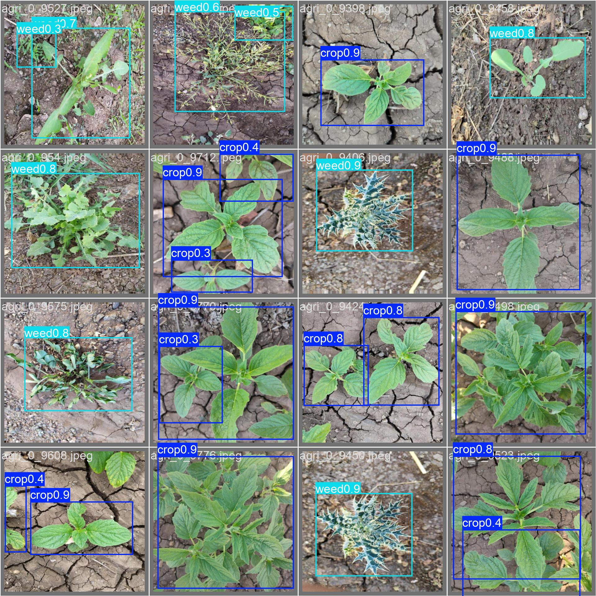
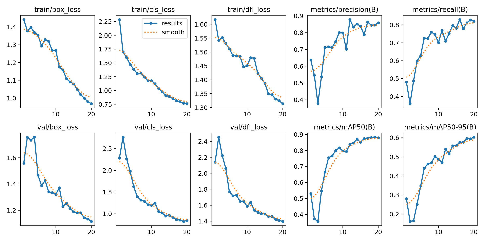
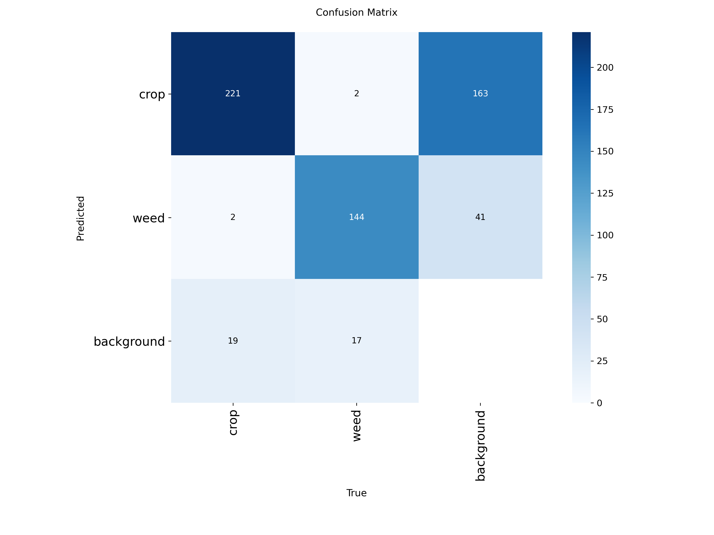

# 🌱 Crop and Weed Detection using YOLOv8

## 📌 Project Overview

This project implements an AI-powered Crop and Weed Detection system using the **YOLOv8 Nano** object detection model. The model is trained on a custom agricultural dataset to detect crops and weeds from field images, supporting precision farming and automated weed management.

---

## 🚀 Features

- 🌾 Detects crops and weeds from agricultural images
- 🤖 YOLOv8 Nano object detection model
- 📦 Bounding box predictions
- 📊 Model training and evaluation
- 🖼️ Image prediction using trained model

---

## 🛠️ Technologies Used

- Python
- YOLOv8 (Ultralytics)
- OpenCV
- NumPy
- Matplotlib
- Google Colab

---

## 📂 Dataset Summary

- **Total Images:** 1300
- **Total Label Files:** 1300
- **Crop Objects:** 1212
- **Weed Objects:** 860

---

## ⚙️ Model Configuration

| Parameter | Value |
|-----------|-------|
| Model | YOLOv8 Nano |
| Epochs | 20 |
| Image Size | 512 × 512 |
| Batch Size | 16 |

---

## 📷 Sample Prediction



---

## 📈 Training Results



---

## 📊 Confusion Matrix



---

## ▶️ How to Run

```bash
pip install -r requirements.txt
```

```python
from ultralytics import YOLO

model = YOLO("best.pt")

model.predict(
    source="image.jpg",
    save=True
)
```

---

## 📁 Project Structure

```
Crop_Weed_Detection/
│
├── Crop_Weed_Detection.ipynb
├── README.md
├── requirements.txt
├── results.png
├── confusion_matrix.png
└── val_batch0_pred.jpg
```

---

## 👨‍💻 Author

**Jayachandiran K**

B.Tech – Artificial Intelligence & Data Science

Nehru Institute of Engineering and Technology

---

⭐ If you found this project useful, consider giving it a ⭐ on GitHub!
